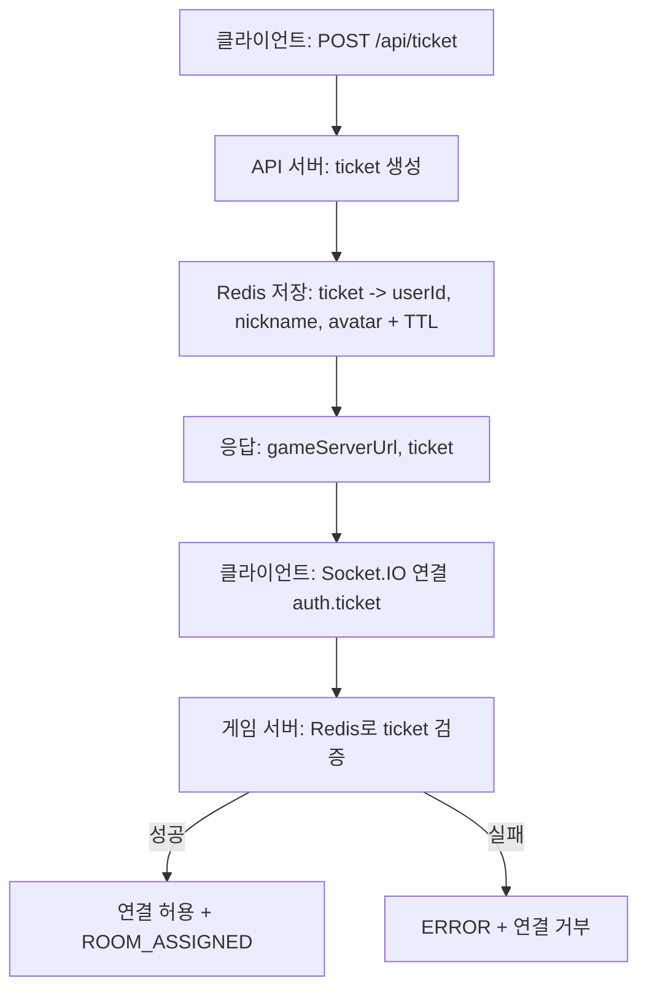
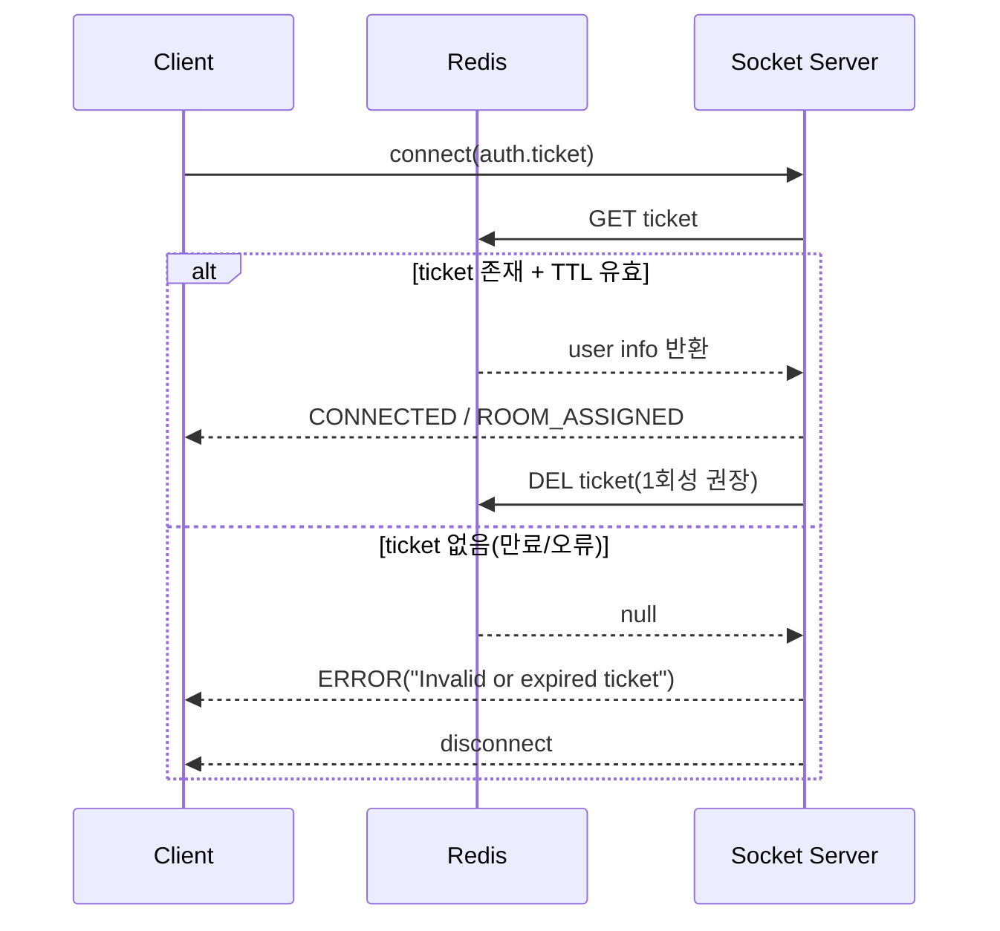

# 인증 방식 정리: Ticket / Session / JWT

## 개요

이 문서는 현재 프로젝트에서 사용하는 **티켓 기반 소켓 입장 방식**을 설명하고,  
추후 도입 가능한 **Session/JWT**와의 차이를 정리합니다.

---

## 1) 티켓(Ticket)이란?

티켓은 로그인 자체를 대체하는 값이 아니라,  
**게임 서버 소켓 입장을 허용할지 판단하는 짧은 수명의 입장권**입니다.

- 짧은 만료 시간(TTL)
- 보통 1회 사용
- 소켓 연결(handshake) 시점에 검증

---

## 2) 현재 프로젝트에서 티켓 사용 방식



핵심:

- 티켓은 **연결 시 1회 검증**이 기본
- 이후 `READY`, `MOVE`, `LEAVE` 등 이벤트는 인증된 소켓 컨텍스트로 처리

---

## 3) 티켓 만료 시 동작



---

## 4) Ticket vs Session vs JWT

| 항목      | Ticket                    | Session            | JWT                     |
| --------- | ------------------------- | ------------------ | ----------------------- |
| 주 용도   | 게임 입장 승인(짧은 권한) | 로그인 상태 유지   | 인증/인가 토큰          |
| 서버 저장 | 보통 Redis 저장           | 서버 저장(필수)    | 보통 저장 안 함(무상태) |
| 만료      | 매우 짧게(초~분)          | 상대적으로 길게    | 설정값에 따름           |
| 재사용    | 보통 1회성                | 세션 유효기간 동안 | 만료 전까지 가능        |
| 소켓 적용 | handshake 1회 검증에 최적 | 쿠키 기반 가능     | 토큰 검증 방식          |

---

## 5) “세션 인증 있으면 티켓이 필요 없나?”

부분적으로만 맞습니다.

- Session/JWT: **사용자 신원 인증**
- Ticket: **게임 입장 권한 인증**

즉 목적이 다릅니다.  
실무에서는 보통 아래 조합이 안정적입니다.

- 로그인: Session 또는 JWT
- 게임 소켓 입장: Ticket(짧은 TTL, 1회성)

---

## 6) 인증 경계(어디까지 티켓 검증인가)

```mermaid
flowchart LR
  A[로그인(Session/JWT)] --> B[/api/ticket 발급]
  B --> C[소켓 handshake에서 ticket 검증]
  C --> D[인증 완료된 socket.data(userId, roomId)]
  D --> E[READY/MOVE/LEAVE 처리]
```

정리:

- 티켓 검증은 **C 단계(연결 시점)** 에서 끝냅니다.
- 이후 이벤트마다 티켓 재검증은 일반적으로 하지 않습니다.

---

## 7) 운영 권장안

1. 로그인/기본 인증: Session 또는 JWT
2. 게임 입장 직전: `/api/ticket` 발급
3. 소켓 연결 시: `auth.ticket` 검증
4. 성공 시: `socket.data`에 사용자 컨텍스트 저장
5. 이벤트 처리: 컨텍스트 기반으로 진행
6. 보안 강화: 티켓 검증 직후 `DEL` 처리(1회성)

---

## 8) 한 줄 요약

티켓은 로그인 대체가 아니라,  
**게임 서버 입장을 짧고 안전하게 제어하는 입장권**입니다.
