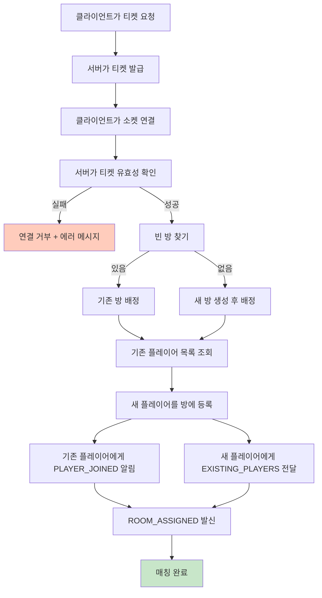

# 멀티플레이 방 매칭 가이드

## 📋 이 문서에서 다루는 범위

이 문서는 **플레이어가 방에 들어오기까지**의 흐름만 설명합니다.

- 티켓 요청
- 서버 접속
- 빈 방 찾기 또는 새 방 생성
- 기존 플레이어와 정보 동기화
- 방 배정 완료

룸에 들어간 뒤 READY/게임 시작/게임 종료 흐름은 아래 문서를 참고하세요.

- [멀티플레이 READY/게임진행 가이드](docs/multiplayer-room-ready-state.md)

---

## 🧭 한눈에 보는 매칭 흐름

---

## 👥 플레이어 관점 시나리오

### 1) 첫 번째 플레이어 입장

- 빈 방이 없어서 새 방이 만들어집니다.
- 기존 플레이어 목록은 비어 있습니다.
- 본인은 `ROOM_ASSIGNED`를 받습니다.

### 2) 두 번째 플레이어 입장

- 기존 방에 빈 자리가 있으면 그 방에 들어갑니다.
- 기존 플레이어는 `PLAYER_JOINED`를 받아 새 사람 입장을 알 수 있습니다.
- 새 플레이어는 `EXISTING_PLAYERS`로 먼저 들어와 있던 사람들을 확인합니다.

### 3) 정원이 찬 경우

- 기존 방이 가득 차면 새 방이 만들어집니다.
- 새로 들어온 플레이어는 새 방의 첫 번째 사람이 됩니다.

---

## 📦 이벤트 의미 (매칭 단계)

| 이벤트           | 의미                            | 누가 받나               |
| ---------------- | ------------------------------- | ----------------------- |
| CONNECTED        | 소켓 연결 성공                  | 접속한 플레이어         |
| PLAYER_JOINED    | 새 플레이어 입장 알림           | 이미 방에 있던 플레이어 |
| EXISTING_PLAYERS | 기존 플레이어 목록 전달         | 새로 들어온 플레이어    |
| ROOM_ASSIGNED    | 최종 방 배정 완료               | 새로 들어온 플레이어    |
| ERROR            | 티켓 만료/유효하지 않음 등 오류 | 해당 플레이어           |

---

## 💡 비전문가용 핵심 설명

- 서버는 먼저 **기존 방에 자리가 있는지** 확인합니다.
- 자리가 있으면 기존 방으로, 없으면 새 방으로 보냅니다.
- 입장 시점에 양쪽(기존/신규) 플레이어가 서로를 알 수 있게 정보를 동시에 맞춥니다.
- 이 과정을 마치면 클라이언트는 방 번호를 받고, 다음 단계(READY)로 넘어갑니다.

---

## 📝 체크리스트

- [x] 티켓 기반 접속 처리
- [x] 빈 방 우선 배정
- [x] 기존/신규 플레이어 정보 동기화
- [x] 입장 완료 이벤트 전달
- [x] 접속 실패 시 에러 응답

---

**작성일**: 2026-03-03  
**버전**: 2.0.0  
**작성자**: Backend Team
