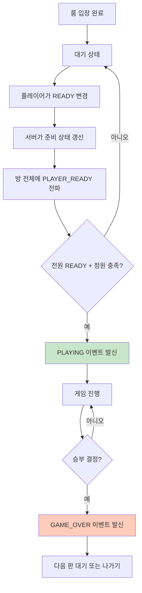
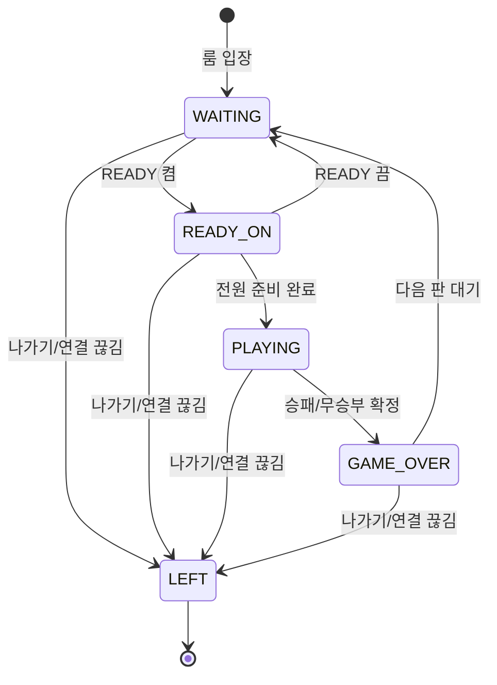

# 멀티플레이 READY/게임진행 가이드

## 📋 이 문서에서 다루는 범위

이 문서는 **방 입장 이후**에 일어나는 흐름을 설명합니다.

- READY 켜기/끄기
- 전원 준비 확인
- 게임 시작
- 플레이 진행
- 게임 종료 및 재대기
- 중간 퇴장 처리

---

## 🚦 게임 시작 조건

게임은 아래 두 조건을 동시에 만족할 때 시작됩니다.

1. 방 인원이 정원 상태여야 함
2. 방 안의 모든 플레이어가 READY 상태여야 함

이 조건이 맞으면 서버가 방 전체에 `PLAYING` 이벤트를 보냅니다.

---

## 🎮 전체 진행 흐름

## 👤 플레이어 상태 변화

---

## 📣 이벤트 의미

| 이벤트       | 사용자가 체감하는 의미         |
| ------------ | ------------------------------ |
| PLAYER_READY | 누가 준비/준비취소 했는지 알림 |
| PLAYING      | 게임 시작 신호                 |
| MOVE         | 누가 어디에 두었는지 반영      |
| GAME_OVER    | 게임 결과 확정                 |
| PLAYER_LEFT  | 상대가 나갔다는 알림           |

---

## 🙋 비전문가용 Q&A

### READY를 다시 끌 수 있나요?

가능합니다. READY를 끄면 다시 대기 상태로 돌아갑니다.

### 왜 바로 시작되지 않나요?

한 명만 준비하면 시작되지 않습니다. **모든 인원이 준비되어야** 시작됩니다.

### 게임 중 누가 나가면 어떻게 되나요?

남은 사람에게 상대 퇴장 알림이 가고, 방은 대기 상태로 복귀할 수 있습니다.

### 게임이 끝난 뒤엔 뭐가 달라지나요?

결과가 공유되고, 다음 판을 위해 다시 READY를 맞추는 단계로 돌아갑니다.

---

**작성일**: 2026-03-03  
**버전**: 2.0.0  
**작성자**: Backend Team
